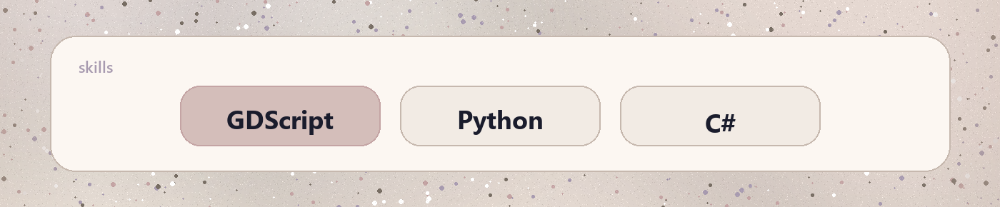
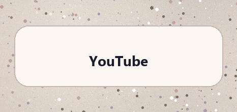
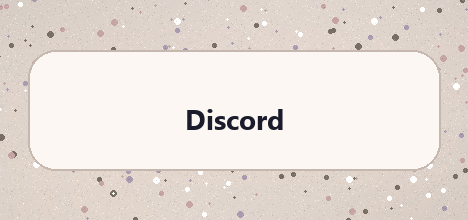
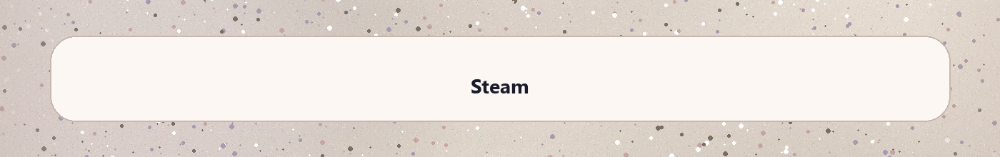
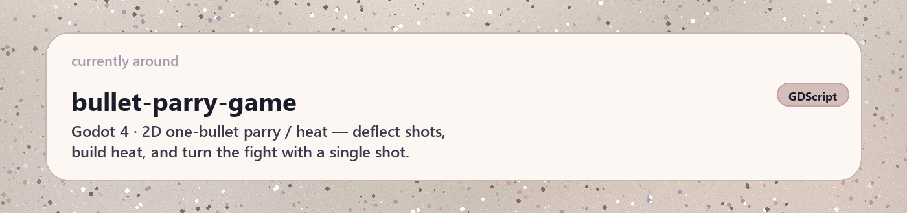
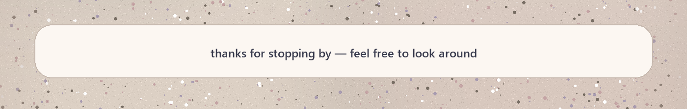

<table border="0" cellpadding="0" cellspacing="0" width="100%"><tr><td></td></tr><tr><td></td></tr><tr><td><table border="0" cellpadding="0" cellspacing="0" width="100%"><tr><td width="33%"></td><td width="34%"></td><td width="33%"></td></tr></table></td></tr><tr><td></td></tr><tr><td></td></tr></table>
